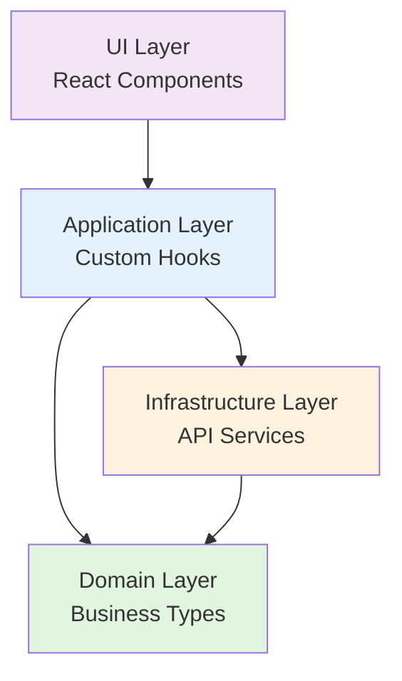

# Clean Architecture Deep Dive

This guide provides a comprehensive exploration of how Clean Architecture principles are implemented in FrontendPT, with real examples from the codebase.

## The Four Layers

FrontendPT implements Clean Architecture through four distinct layers, each with specific responsibilities and constraints:



## Domain Layer

### Purpose
The domain layer is the heart of the application, containing:
- Core business entities
- Business rules
- Type definitions
- Factory functions

### Characteristics
- **Zero dependencies** on other layers
- **Pure functions** with no side effects
- **Framework agnostic** - can be used in any JavaScript environment

### Implementation

**Location**: `src/domain/types.js`

The domain layer defines factory functions that create properly structured business entities:

```javascript
// Product entity factory from src/domain/types.js:3
export const createProduct = data => ({
  id: data.id,
  name: data.name,
  price: parseFloat(data.price),  // Ensures price is always a number
  stock: data.stock,
  category_id: data.category_id,
  category: data.category ?? null,  // Null-safe category relationship
});

// Category entity factory from src/domain/types.js:12
export const createCategory = data => ({
  id: data.id,
  name: data.name,
});

// Client entity factory from src/domain/types.js:17
export const createClient = data => ({
  id: data.id,
  name: data.name,
  email: data.email,
  phone: data.phone,
});
```

### Why Factory Functions?

Factory functions provide several benefits:

1. **Type safety**: Ensures consistent object structure
2. **Data transformation**: Converts API data to domain models (e.g., parsing price)
3. **Default values**: Handles missing data gracefully (e.g., `category ?? null`)
4. **Validation**: Can add validation logic in one place

<Tip>
Factory functions act as the single source of truth for entity structure, making refactoring easier.
</Tip>

### Domain Layer Best Practices

<AccordionGroup>
  <Accordion title="Keep it pure">
    Domain functions should have no side effects - same input always produces same output.
    ```javascript
    // Good: Pure function
    export const createProduct = data => ({ ...data, price: parseFloat(data.price) });
    
    // Bad: Side effect
    export const createProduct = data => {
      console.log('Creating product');  // Side effect!
      return { ...data };
    };
    ```
  </Accordion>
  
  <Accordion title="No framework dependencies">
    Domain layer should never import React, axios, or any framework-specific code.
    ```javascript
    // Good: Pure JavaScript
    export const createProduct = data => ({ ... });
    
    // Bad: Framework dependency
    import { useState } from 'react';  // Don't do this in domain!
    ```
  </Accordion>
  
  <Accordion title="Business rules belong here">
    Any business logic that doesn't depend on external services should be in the domain.
    ```javascript
    export const createProduct = data => ({
      ...data,
      price: parseFloat(data.price),
      inStock: data.stock > 0,  // Business rule
      isLowStock: data.stock < 10,  // Business rule
    });
    ```
  </Accordion>
</AccordionGroup>

---

## Infrastructure Layer

### Purpose
The infrastructure layer handles all external concerns:
- API communication
- Database access
- Third-party services
- File system operations

### Characteristics
- **Depends on Domain** for type definitions
- **Independent of Application and UI** layers
- **Encapsulates external dependencies**

### Implementation

**Location**: `src/infrastructure/`

#### Base API Configuration

From `src/infrastructure/api.js:5`:
```javascript
import axios from "axios";

const api = axios.create({
  baseURL: "http://localhost:8000/api",
  headers: {
    "Content-Type": "application/json",
    Accept: "application/json",
  },
});

export default api;
```

This central configuration:
- Defines the backend URL
- Sets default headers
- Can be extended with interceptors for auth, logging, etc.

#### Service Pattern

Each domain has a corresponding service file that encapsulates API operations.

**Product Service** from `src/infrastructure/productService.js:3`:
```javascript
import api from "./api";

// GET products with pagination and filters
export const getProducts = async (page = 1, search = "", category_id = "") => {
  const params = { page, search };
  
  // Only include category_id if provided
  if (category_id !== "") params.category_id = category_id;
  
  const { data } = await api.get("/products", { params });
  return data;
};

// GET all products (for dropdowns, etc.)
export const getAllProducts = async () => {
  const { data } = await api.get("/products/all");
  return data.products;
};

// POST create new product
export const createProduct = async product => {
  const { data } = await api.post("/products", product);
  return data.product;
};

// PUT update existing product
export const updateProduct = async (id, product) => {
  const { data } = await api.put(`/products/${id}`, product);
  return data.product;
};

// DELETE product
export const deleteProduct = async id => {
  await api.delete(`/products/${id}`);
};
```

**Category Service** from `src/infrastructure/categoryService.js:3`:
```javascript
import api from "./api";

export const getCategories = async () => {
  const { data } = await api.get("/categories");
  return data.categories;
};

export const createCategory = async name => {
  const { data } = await api.post("/categories", { name });
  return data.category;
};

export const updateCategory = async (id, name) => {
  const { data } = await api.put(`/categories/${id}`, { name });
  return data.category;
};

export const deleteCategory = async id => {
  await api.delete(`/categories/${id}`);
};
```

### Service Design Patterns

#### Consistent Function Signatures
```javascript
// Read operations: Return data directly
export const getProducts = async (params) => {
  const { data } = await api.get("/products", { params });
  return data;  // Return unwrapped data
};

// Write operations: Return created/updated entity
export const createProduct = async (product) => {
  const { data } = await api.post("/products", product);
  return data.product;  // Return the created entity
};

// Delete operations: No return value needed
export const deleteProduct = async (id) => {
  await api.delete(`/products/${id}`);
};
```

#### Error Handling
Services throw errors that are caught by the application layer:
```javascript
export const getProducts = async (page, search) => {
  // Errors are propagated to application layer
  const { data } = await api.get("/products", { params: { page, search } });
  return data;
};
```

### Infrastructure Best Practices

<CardGroup cols={2}>
  <Card title="Encapsulate external APIs" icon="shield">
    Services should hide implementation details. Application layer shouldn't know you're using axios.
  </Card>
  <Card title="Named exports" icon="file-export">
    Use named exports for service functions to make imports explicit and tree-shakeable.
  </Card>
  <Card title="Async by default" icon="clock">
    All service functions should be async, even if they don't await anything yet.
  </Card>
  <Card title="Single responsibility" icon="bullseye">
    Each service should handle one domain (products, categories, etc.).
  </Card>
</CardGroup>

---

## Application Layer

### Purpose
The application layer orchestrates the flow of data:
- Coordinates infrastructure services
- Manages application state
- Implements use cases
- Handles side effects

### Characteristics
- **Depends on Domain and Infrastructure**
- **Independent of UI** (can be reused across different UIs)
- **Framework-aware** (uses React hooks)

### Implementation

**Location**: `src/application/hooks/`

#### Product Hook

From `src/application/hooks/useProducts.js:4`:
```javascript
import { useState, useEffect, useCallback } from "react";
import * as productService from "../../infrastructure/productService";

export function useProducts() {
  // State management
  const [products, setProducts] = useState([]);
  const [allProducts, setAllProducts] = useState([]);
  const [pagination, setPagination] = useState(null);
  const [loading, setLoading] = useState(true);
  const [error, setError] = useState(null);
  const [search, setSearch] = useState("");
  const [page, setPage] = useState(1);

  // Fetch products with memoization
  const fetchProducts = useCallback(async () => {
    try {
      setLoading(true);
      const data = await productService.getProducts(page, search);
      setProducts(data.products.data);
      setPagination(data.products);
      setError(null);  // Clear previous errors
    } catch (err) {
      setError("Error al cargar productos");
    } finally {
      setLoading(false);
    }
  }, [page, search]);

  // Fetch on mount and when dependencies change
  useEffect(() => {
    fetchProducts();
  }, [fetchProducts]);

  // Fetch all products (for dropdowns)
  useEffect(() => {
    productService.getAllProducts().then(setAllProducts);
  }, []);

  // CRUD operations
  const addProduct = async product => {
    await productService.createProduct(product);
    fetchProducts();  // Refresh list
  };

  const editProduct = async (id, product) => {
    await productService.updateProduct(id, product);
    fetchProducts();
  };

  const removeProduct = async id => {
    await productService.deleteProduct(id);
    fetchProducts();
  };

  // Public API
  return {
    products,
    allProducts,
    pagination,
    loading,
    error,
    search,
    setSearch,
    page,
    setPage,
    addProduct,
    editProduct,
    removeProduct,
  };
}
```

#### Category Hook

From `src/application/hooks/useCategories.js:4`:
```javascript
import { useState, useEffect } from "react";
import * as categoryService from "../../infrastructure/categoryService";

export function useCategories() {
  const [categories, setCategories] = useState([]);
  const [loading, setLoading] = useState(true);
  const [error, setError] = useState(null);
  const [catPage, setCatPage] = useState(1);
  const itemsPerPage = 10;

  const fetchCategories = async () => {
    try {
      setLoading(true);
      const data = await categoryService.getCategories();
      setCategories(data);
    } catch (err) {
      setError("Error al cargar categorías");
    } finally {
      setLoading(false);
    }
  };

  useEffect(() => {
    fetchCategories();
  }, []);

  const addCategory = async name => {
    const newCat = await categoryService.createCategory(name);
    setCategories(prev => [...prev, newCat]);  // Optimistic update
  };

  const editCategory = async (id, name) => {
    const updated = await categoryService.updateCategory(id, name);
    setCategories(prev => prev.map(c => (c.id === id ? updated : c)));
  };

  const removeCategory = async id => {
    await categoryService.deleteCategory(id);
    setCategories(prev => prev.filter(c => c.id !== id));
  };

  // Client-side pagination (categories fetched all at once)
  const paginatedCategories = categories.slice(
    (catPage - 1) * itemsPerPage,
    catPage * itemsPerPage
  );

  const catPagination = {
    current_page: catPage,
    last_page: Math.ceil(categories.length / itemsPerPage),
  };

  return {
    categories,
    paginatedCategories,
    catPagination,
    setCatPage,
    loading,
    error,
    addCategory,
    editCategory,
    removeCategory,
  };
}
```

#### Toast Hook (UI Logic)

From `src/application/hooks/useToast.js:3`:
```javascript
import { useState, useCallback } from "react";

export function useToast() {
  const [toast, setToast] = useState(null);

  const showToast = useCallback((message, type = "success") => {
    setToast({ message, type });
  }, []);

  const hideToast = useCallback(() => {
    setToast(null);
  }, []);

  return { toast, showToast, hideToast };
}
```

### Hook Design Patterns

#### State Management Pattern
```javascript
const [data, setData] = useState([]);       // Main data
const [loading, setLoading] = useState(true);  // Loading state
const [error, setError] = useState(null);    // Error state
```

#### Fetch with Error Handling
```javascript
const fetchData = async () => {
  try {
    setLoading(true);
    const data = await service.getData();
    setData(data);
    setError(null);  // Clear previous errors
  } catch (err) {
    setError(err.message);
  } finally {
    setLoading(false);  // Always stop loading
  }
};
```

#### Optimistic Updates
```javascript
const addItem = async (item) => {
  const created = await service.createItem(item);
  setItems(prev => [...prev, created]);  // Add to local state immediately
};

const editItem = async (id, updates) => {
  const updated = await service.updateItem(id, updates);
  setItems(prev => prev.map(item => item.id === id ? updated : item));
};

const removeItem = async (id) => {
  await service.deleteItem(id);
  setItems(prev => prev.filter(item => item.id !== id));
};
```

### Application Layer Best Practices

<AccordionGroup>
  <Accordion title="Return consistent interface">
    Hooks should return a consistent object shape with data, loading, error, and action functions.
    ```javascript
    return {
      // Data
      items,
      pagination,
      // State
      loading,
      error,
      // Actions
      addItem,
      editItem,
      removeItem,
      // Filters
      search,
      setSearch,
    };
    ```
  </Accordion>
  
  <Accordion title="Handle loading and errors">
    Always manage loading and error states to provide good UX.
    ```javascript
    const [loading, setLoading] = useState(true);
    const [error, setError] = useState(null);
    
    try {
      setLoading(true);
      const data = await service.getData();
      setError(null);  // Clear errors on success
    } catch (err) {
      setError(err.message);
    } finally {
      setLoading(false);
    }
    ```
  </Accordion>
  
  <Accordion title="Use useCallback for functions">
    Memoize functions that are used as dependencies to prevent unnecessary re-renders.
    ```javascript
    const fetchData = useCallback(async () => {
      // ...
    }, [page, search]);  // Only recreate when dependencies change
    ```
  </Accordion>
  
  <Accordion title="Separate concerns">
    One hook per domain or use case. Don't create "god hooks" that do everything.
    ```javascript
    // Good: Focused hooks
    useProducts()  // Product management
    useToast()     // Toast notifications
    
    // Bad: Everything in one hook
    useApp()  // Products, categories, clients, toasts...
    ```
  </Accordion>
</AccordionGroup>

---

## UI Layer

### Purpose
The UI layer handles presentation and user interaction:
- Render data to screen
- Capture user input
- Display feedback
- Navigation

### Characteristics
- **Depends on Application layer** for business logic
- **May use Domain types** for type definitions
- **Framework-specific** (React components)

### Implementation

**Location**: `src/ui/`

#### Component Structure

From `src/ui/components/Modal.jsx:2`:
```javascript
function Modal({ title, onClose, children }) {
  return (
    <div className="fixed inset-0 bg-black/30 flex items-center justify-center z-50">
      <div className="bg-white rounded-xl shadow-xl w-full max-w-md p-6">
        <div className="flex justify-between items-center mb-5">
          <h2 className="text-lg font-semibold text-gray-800">{title}</h2>
          <button 
            onClick={onClose} 
            className="text-gray-400 hover:text-gray-600 text-xl leading-none"
          >
            ×
          </button>
        </div>
        {children}
      </div>
    </div>
  );
}

export default Modal;
```

#### Page Structure

From `src/ui/pages/products/ProductsPage.jsx:12`:
```javascript
import { useState } from "react";
import { useProducts } from "../../../application/hooks/useProducts";
import { useCategories } from "../../../application/hooks/useCategories";
import PageHeader from "../../components/PageHeader";
import SearchBar from "../../components/SearchBar";
import Pagination from "../../components/Pagination";
import Modal from "../../components/Modal";
import Toast from "../../components/Toast";
import { useToast } from "../../../application/hooks/useToast";

function ProductsPage() {
  // Application layer hooks
  const {
    products,
    pagination,
    loading,
    search,
    setSearch,
    setPage,
    addProduct,
    editProduct,
    removeProduct,
  } = useProducts();
  
  const { categories } = useCategories();
  const { toast, showToast, hideToast } = useToast();

  // Local UI state
  const [showModal, setShowModal] = useState(false);
  const [editing, setEditing] = useState(null);
  const [form, setForm] = useState({ 
    name: "", 
    price: "", 
    stock: "", 
    category_id: "" 
  });
  const [formError, setFormError] = useState("");

  // Event handlers
  const openCreate = () => {
    setEditing(null);
    setForm({ name: "", price: "", stock: "", category_id: "" });
    setFormError("");
    setShowModal(true);
  };

  const openEdit = product => {
    setEditing(product);
    setForm({
      name: product.name,
      price: product.price,
      stock: product.stock,
      category_id: product.category_id,
    });
    setFormError("");
    setShowModal(true);
  };

  const handleSubmit = async () => {
    // Validation
    if (!form.name || !form.price || !form.stock || !form.category_id) {
      setFormError("Todos los campos son obligatorios");
      return;
    }
    
    try {
      if (editing) {
        await editProduct(editing.id, form);
        showToast("Producto actualizado correctamente");
      } else {
        await addProduct(form);
        showToast("Producto creado correctamente");
      }
      setShowModal(false);
    } catch (err) {
      setFormError(err.response?.data?.message ?? "Error al guardar");
      showToast(err.response?.data?.message ?? "Error al guardar", "error");
    }
  };

  const handleDelete = async id => {
    if (!confirm("¿Eliminar este producto?")) return;
    try {
      await removeProduct(id);
    } catch (err) {
      alert(err.response?.data?.message ?? "No se pudo eliminar");
    }
  };

  // Render
  return (
    <div>
      <PageHeader
        title="Productos"
        subtitle="Catálogo y gestión de precios"
        action={
          <button 
            onClick={openCreate}
            className="bg-primary hover:bg-primary-hover text-white text-sm font-medium px-4 py-2 rounded-lg transition-colors"
          >
            + Nuevo producto
          </button>
        }
      />

      <SearchBar
        value={search}
        onChange={val => {
          setSearch(val);
          setPage(1);
        }}
        placeholder="Buscar producto..."
      />

      {/* Data table */}
      <div className="bg-white rounded-xl border border-gray-100 overflow-hidden">
        <table className="w-full text-sm">
          <thead>
            <tr className="text-xs text-gray-400 uppercase border-b border-gray-100">
              <th className="text-left px-4 py-3">ID</th>
              <th className="text-left px-4 py-3">Nombre</th>
              <th className="text-left px-4 py-3">Precio</th>
              <th className="text-left px-4 py-3">Stock</th>
              <th className="text-left px-4 py-3">Categoría</th>
              <th className="text-left px-4 py-3">Acciones</th>
            </tr>
          </thead>
          <tbody>
            {loading ? (
              <tr>
                <td colSpan={6} className="text-center py-8 text-gray-400">
                  Cargando...
                </td>
              </tr>
            ) : (
              products.map(product => (
                <tr key={product.id} className="border-b border-gray-50 hover:bg-gray-50/50">
                  <td className="px-4 py-3 text-gray-400">{product.id}</td>
                  <td className="px-4 py-3 text-gray-800">{product.name}</td>
                  <td className="px-4 py-3">${parseFloat(product.price).toFixed(2)}</td>
                  <td className="px-4 py-3">{product.stock}</td>
                  <td className="px-4 py-3 text-gray-500">{product.category?.name ?? "—"}</td>
                  <td className="px-4 py-3 flex gap-2">
                    <button 
                      onClick={() => openEdit(product)} 
                      className="px-3 py-1 text-xs border border-primary text-primary rounded hover:bg-primary-light transition-colors"
                    >
                      Editar
                    </button>
                    <button 
                      onClick={() => handleDelete(product.id)} 
                      className="px-3 py-1 text-xs border border-red-300 text-red-400 rounded hover:bg-red-50 transition-colors"
                    >
                      Eliminar
                    </button>
                  </td>
                </tr>
              ))
            )}
          </tbody>
        </table>
      </div>

      <Pagination pagination={pagination} onPageChange={setPage} />

      {/* Create/Edit Modal */}
      {showModal && (
        <Modal 
          title={editing ? "Editar producto" : "Nuevo producto"} 
          onClose={() => setShowModal(false)}
        >
          <div className="flex flex-col gap-3">
            <input 
              className="input" 
              placeholder="Nombre" 
              value={form.name} 
              onChange={e => setForm({ ...form, name: e.target.value })} 
            />
            <input 
              className="input" 
              type="number" 
              placeholder="Precio" 
              value={form.price} 
              onChange={e => setForm({ ...form, price: e.target.value })} 
            />
            <input 
              className="input" 
              type="number" 
              placeholder="Stock" 
              value={form.stock} 
              onChange={e => setForm({ ...form, stock: e.target.value })} 
            />
            <select 
              className="input" 
              value={form.category_id} 
              onChange={e => setForm({ ...form, category_id: e.target.value })}
            >
              <option value="">Selecciona categoría</option>
              {categories.map(c => (
                <option key={c.id} value={c.id}>
                  {c.name}
                </option>
              ))}
            </select>
            {formError && <p className="text-red-400 text-xs">{formError}</p>}
            <button 
              onClick={handleSubmit} 
              className="bg-primary hover:bg-primary-hover text-white py-2 rounded-lg text-sm font-medium transition-colors mt-1"
            >
              {editing ? "Guardar cambios" : "Crear producto"}
            </button>
          </div>
        </Modal>
      )}

      {/* Toast notifications */}
      {toast && <Toast message={toast.message} type={toast.type} onClose={hideToast} />}
    </div>
  );
}

export default ProductsPage;
```

### UI Design Patterns

#### Component Composition
```javascript
// Reusable components composed together
<PageHeader title="Products" subtitle="Manage inventory" />
<SearchBar value={search} onChange={setSearch} />
<Pagination pagination={data} onPageChange={setPage} />
```

#### Controlled Components
```javascript
// Form inputs controlled by React state
<input 
  value={form.name} 
  onChange={e => setForm({ ...form, name: e.target.value })} 
/>
```

#### Conditional Rendering
```javascript
{loading ? (
  <LoadingSpinner />
) : (
  <DataTable data={products} />
)}

{showModal && <Modal>...</Modal>}
```

### UI Layer Best Practices

<CardGroup cols={2}>
  <Card title="Thin components" icon="feather">
    Components should be thin wrappers around application hooks. Business logic belongs in hooks.
  </Card>
  <Card title="Composable design" icon="puzzle-piece">
    Build small, reusable components that can be composed into complex UIs.
  </Card>
  <Card title="Separation of state" icon="layer-group">
    Distinguish between application state (from hooks) and local UI state (useState).
  </Card>
  <Card title="Event handlers" icon="hand-pointer">
    Name event handlers with 'handle' prefix: handleSubmit, handleDelete, etc.
  </Card>
</CardGroup>

---

## Layer Communication

### Dependency Flow

```
UI Layer
  ↓ imports
Application Layer (useProducts)
  ↓ imports
Infrastructure Layer (productService)
  ↓ imports
Domain Layer (createProduct)
```

### Data Flow Example

**User creates a product:**

1. **UI**: User fills form, clicks "Create"
   ```javascript
   const handleSubmit = () => addProduct(form);  // Call application layer
   ```

2. **Application**: Hook receives request, calls service
   ```javascript
   const addProduct = async (product) => {
     await productService.createProduct(product);  // Call infrastructure
     fetchProducts();  // Refresh data
   };
   ```

3. **Infrastructure**: Service makes API call
   ```javascript
   export const createProduct = async (product) => {
     const { data } = await api.post("/products", product);
     return data.product;  // Return to application
   };
   ```

4. **Application**: Updates state, UI re-renders
   ```javascript
   setProducts([...products, newProduct]);
   ```

### Error Flow

```
Infrastructure (throws error)
       ↓
Application (catches, sets error state)
       ↓
UI (displays error message)
```

---

## Testing by Layer

### Domain Layer Tests
```javascript
import { createProduct } from '../domain/types';

test('createProduct ensures price is a number', () => {
  const product = createProduct({ id: 1, name: 'Test', price: '19.99' });
  expect(typeof product.price).toBe('number');
  expect(product.price).toBe(19.99);
});
```

### Infrastructure Layer Tests
```javascript
import * as productService from '../infrastructure/productService';
import api from '../infrastructure/api';

jest.mock('../infrastructure/api');

test('getProducts calls API with correct params', async () => {
  api.get.mockResolvedValue({ data: { products: [] } });
  
  await productService.getProducts(1, 'search');
  
  expect(api.get).toHaveBeenCalledWith('/products', {
    params: { page: 1, search: 'search' }
  });
});
```

### Application Layer Tests
```javascript
import { renderHook, act } from '@testing-library/react-hooks';
import { useProducts } from '../application/hooks/useProducts';

test('useProducts fetches products on mount', async () => {
  const { result, waitForNextUpdate } = renderHook(() => useProducts());
  
  expect(result.current.loading).toBe(true);
  
  await waitForNextUpdate();
  
  expect(result.current.loading).toBe(false);
  expect(result.current.products).toBeDefined();
});
```

### UI Layer Tests
```javascript
import { render, screen } from '@testing-library/react';
import ProductsPage from '../ui/pages/products/ProductsPage';

test('displays products in table', () => {
  render(<ProductsPage />);
  
  expect(screen.getByText('Productos')).toBeInTheDocument();
  expect(screen.getByPlaceholderText('Buscar producto...')).toBeInTheDocument();
});
```

---

## Summary

<CardGroup cols={2}>
  <Card title="Domain Layer" icon="circle" color="#4caf50">
    Pure business entities and types. Zero dependencies.
  </Card>
  <Card title="Application Layer" icon="circle" color="#2196f3">
    Orchestrates use cases with React hooks. Depends on Domain and Infrastructure.
  </Card>
  <Card title="Infrastructure Layer" icon="circle" color="#ff9800">
    Handles external APIs and services. Depends on Domain.
  </Card>
  <Card title="UI Layer" icon="circle" color="#9c27b0">
    React components and pages. Depends on Application.
  </Card>
</CardGroup>

<Tip>
**Remember**: Dependencies always point inward. Outer layers depend on inner layers, never the reverse.
</Tip>

## Next Steps

<Card title="API Reference" icon="code" href="/api/hooks/use-products">
  Explore the hooks and services API
</Card>
